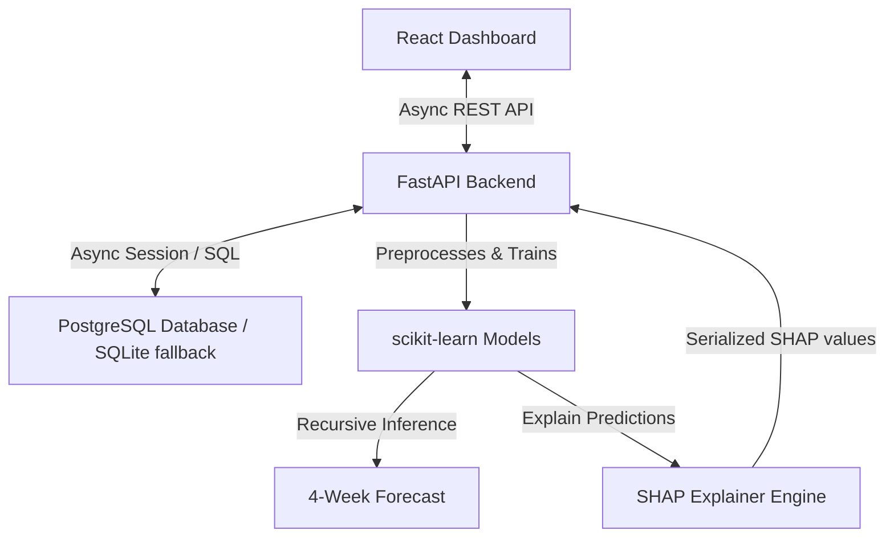
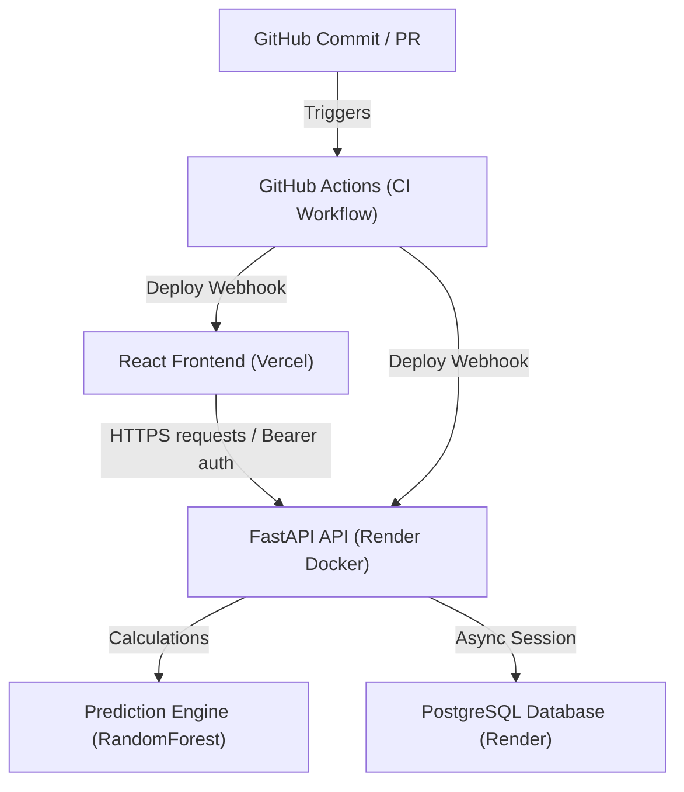

# Aegis AI: Predictive Test Analytics & Forecasting Platform

A production-grade, AI-powered predictive analytics platform designed to forecast software testing metrics (story tests, automated/manual regression execution, bug influx, and automation pass rates) for the next month based on weekly test reports. 

This platform showcases modern, full-stack software development practices, utilizing an **asynchronous Python backend (FastAPI)**, a **Time-Series Machine Learning Pipeline (scikit-learn)** with **Model Interpretability (SHAP)**, and a **highly aesthetic, responsive glassmorphic React dashboard (Vite + TypeScript + Tailwind CSS)**.

---

## 🔮 Key Features

1. **Async FastAPI Engine**: High-performance, asynchronous REST API leveraging FastAPI and Async SQLAlchemy ORM for database operations.
2. **Recursive ML Forecasts**: A time-series prediction pipeline that builds historical lag features and trains independent **Random Forest Regressor** models to recursively project weekly metrics up to 4 weeks out.
3. **Model Interpretability (SHAP)**: Implements **SHAP (SHapley Additive exPlanations)** values to quantify and visualize how previous week metrics, rolling trends, and seasonal temporal factors impact the AI's forecasts.
4. **Stunning Glassmorphic Dashboard**: A premium, dark-mode dashboard built with React, TypeScript, Tailwind CSS, and Recharts, showing continuous timelines of actuals extending into dotted forecasted lines.
5. **Interactive Explainer Panel**: Explains prediction values interactively by mapping SHAP values onto positive/negative impact rankings with custom hover descriptions.
6. **Dockerized PostgreSQL**: Easy deployment of a PostgreSQL database with automatic connection handling and a localized SQLite fallback for zero-dependency local runs.
7. **Comprehensive Data Seeder**: Generates 52 weeks of structured test histories showing realistic sprints, rising automation, and cyclical bug cycles to test models immediately.

---

## 🏗️ Architecture



---

## 🌐 Deployment Architecture



---

## 🚀 Quick Start Guide

### Option 1: Run with Docker Compose (Recommended)

To run the database and have the platform connect to it automatically:

1. **Start PostgreSQL**:
   ```bash
   docker-compose up -d
   ```
2. **Setup Backend**:
   ```bash
   cd backend
   python -m venv .venv
   .venv\Scripts\activate  # On Linux/macOS: source .venv/bin/activate
   pip install -r requirements.txt
   python app/main.py
   ```
3. **Setup Frontend**:
   ```bash
   cd frontend
   npm install
   npm run dev
   ```
4. Open your browser and go to `http://localhost:5173`. The database will automatically initialize tables and seed mock data for **Project Pegasus** and **Project Orion** on startup!

---

### Option 2: Full Local Run (No Dependencies/Docker)

If you don't have Docker installed, the application will automatically fallback to a local SQLite database file (`test_prediction.db`).

1. **Setup Backend**:
   ```bash
   cd backend
   python -m venv .venv
   .venv\Scripts\activate
   pip install -r requirements.txt
   python app/main.py
   ```
2. **Setup Frontend**:
   ```bash
   cd frontend
   npm install
   npm run dev
   ```
3. Access the dashboard at `http://localhost:5173`.

---

## 🧪 Verification & Testing

### Backend Unit Tests
To run the automated tests validating API routing, DB transactions, seeding, and forecasting calculations:
```bash
cd backend
.venv\Scripts\activate
pytest
```

### Frontend Compilation
Verify that the TypeScript types compile and the production React bundle builds without warnings:
```bash
cd frontend
npm run build
```

---

## 🛠️ Tech Stack & Technologies

* **Programming Languages**: Python, TypeScript, JavaScript
* **Backend Framework**: FastAPI, Uvicorn, Pydantic, SQLAlchemy, asyncpg
* **Machine Learning**: Pandas, NumPy, scikit-learn, SHAP (model explainability)
* **Database**: PostgreSQL (Dockerized), SQLite (fallback)
* **Frontend**: React (Vite), Tailwind CSS, Recharts, Lucide Icons
* **Testing**: PyTest, HTTPX AsyncClient
* **Deployment & Containers**: Docker Compose, Docker
